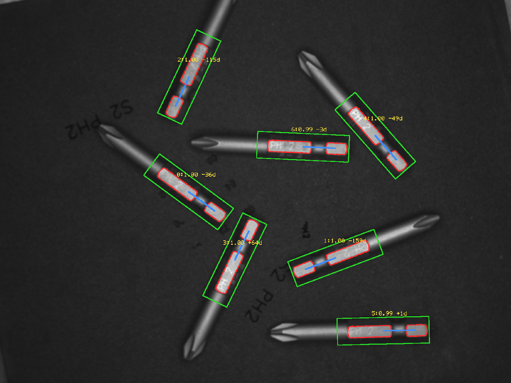
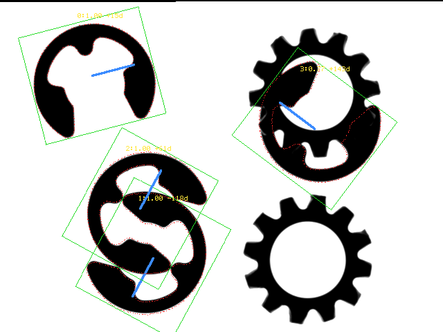
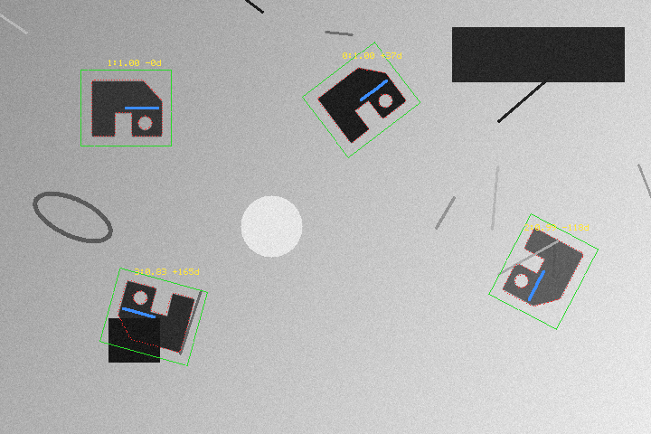

# geofit

Rotation- and scale-invariant shape matching for machine vision — **find a part at any
angle**, under changing illumination, with pieces of it missing.

[](https://pypi.org/project/geofit/)
[](https://pypi.org/project/geofit/)
[](https://pypi.org/project/geofit/#files)
[](#license)

The model is a set of **edge points plus unit gradient direction vectors**, and similarity
is the mean dot product of those directions. Gradient *magnitude* is thrown away, which is
what makes the score indifferent to illumination and contrast. It is a sum, so an occluded
point contributes zero instead of breaking the match. Rotation is applied to the *model*,
not the image.

**A C++ core with a numpy-only Python API.** No OpenCV, no PyTorch, nothing to configure.
A 2592×1944 image searched over the full 360° takes about 20 ms.

```bash
pip install geofit
geofit demo --save result.png     # runs on a bundled sample, nothing else needed
```

---

## What it looks like

Seven screwdriver bits on a dark background, every one at a different angle. Red dots are
the model's edge points mapped into the pose that was found; the green box is the template
outline and the blue line points along the template's 0° axis.



Four retaining clips, two of them overlapping and one lying on top of a gear. All four are
found and told apart, in 4 ms:



The bundled sample — four rotated instances, an illumination gradient across the frame,
noise, and one instance about 30% occluded (bottom left, still scoring 0.83):



---

## Install

```bash
pip install geofit
```

Python 3.10 – 3.14 on Windows x86-64, Linux x86-64 / aarch64, macOS arm64 / x86-64.
The only runtime dependency is **numpy**.

Reading and writing PNG and PGM needs nothing else. Other formats (JPEG, TIFF, …) go
through Pillow if it is installed:

```bash
pip install "geofit[image]"
```

The wheel is tagged `py3-none-<platform>`: it does not link against the CPython ABI, so one
file covers every supported Python and keeps working when a new one is released.

---

## Quick start

```python
import geofit as gf

template = gf.imread("template.png")      # uint8 grayscale numpy array
image    = gf.imread("scene.png")

model = gf.ShapeModel.create(template)
matches = model.find(image, min_score=0.6, num_matches=0)   # 0 = find them all

for m in matches:
    print(m.x, m.y, m.angle, m.scale, m.score)

gf.imwrite("result.png", gf.overlay(image, model, matches))
```

`m.x, m.y` is where the **centre of the template** landed, in image pixels. `m.angle` is
degrees, positive counter-clockwise on screen. To map a template coordinate `p` into the
image: `R(angle) @ (scale * (p - center)) + (x, y)` — or call `model.transform(m)`.

Any uint8 grayscale numpy array works, so `gf.imread` is a convenience rather than a
requirement: OpenCV, Pillow, scikit-image or a frame grabber SDK all feed it directly.

```python
import cv2
image = cv2.imread("scene.png", cv2.IMREAD_GRAYSCALE)
matches = model.find(image, min_score=0.6)
```

---

## Command line

```bash
geofit demo                            # bundled sample, prints the matches
geofit demo --save result.png          # ... and writes an overlay image
geofit find -t tpl.png -i scene.png --min-score 0.6 --save out.png
geofit find -t tpl.png -i scene.png --json        # machine-readable
geofit info                            # version, SIMD path, threads, licence
geofit bench                           # quick timing on the bundled sample
geofit check                           # licence key and evaluation status
```

`geofit demo` needs no files of your own — a synthetic template and scene ship inside the
package, and `geofit.sample_paths()` returns where they are.

```
$ geofit demo
template 100x84  image 720x480
model    3 levels, points [131, 127, 93], built in 6.8 ms
search   8.8 ms  (pyramid 5.1 / top level 3.3 / refine 0.4)
         early termination: 43.5% of the work done (2.3x saved)

4 matches
    #          x          y     angle   scale   score
    0     399.21     110.05    +37.22   1.000   0.998
    1     139.39     118.91     -0.05   1.000   0.998
    2     600.81     300.02   -117.76   1.000   0.995
    3     169.52     349.99   +164.53   1.000   0.828
```

`--json` prints the same thing as a JSON document on stdout and nothing else, so it drops
straight into a pipeline.

---

## Python API

### `ShapeModel.create(template, ...)`

| | default | |
|---|---|---|
| `num_levels` | 0 (auto) | pyramid levels |
| `min_dist` | 3.0 | minimum spacing between model points, px. Larger is faster |
| `max_points` | 400 | maximum points per level |
| `min_contrast` | 15.0 | gradients below this are treated as noise |
| `canny` | (0, 0) = auto | explicit Canny thresholds when you want them |
| `blur` | 1.0 | Gaussian sigma before computing gradients |

### `model.find(image, ...)`

| | default | |
|---|---|---|
| `min_score` | 0.5 | minimum similarity, 0–1 |
| `num_matches` | 1 | **0 returns every match above `min_score`** |
| `max_overlap` | 0.5 | rotated-rectangle IoU above which a match is suppressed |
| `greediness` | 0.7 | 0 never misses a match, 1 is fastest |
| `angle_start` / `angle_extent` | −180 / 360 | narrowing this speeds the search proportionally |
| `scale_min` / `scale_max` / `scale_step` | 1 / 1 / 0.05 | isotropic scale search |
| `metric` | `use_polarity` | `ignore_global_polarity` when background brightness flips |
| `subpixel` | True | parabola fit on position and angle |
| `num_threads` | 0 | 0 uses one thread per core |
| `with_timing` | False | also return per-stage timings |

Calls release the GIL, so several `find()` calls from Python threads genuinely run in
parallel.

```python
matches, t = model.find(image, min_score=0.6, num_matches=0, with_timing=True)
print(t.total_ms, t.toplevel_ms, t.early_termination_ratio)
```

### Other functions

| | |
|---|---|
| `gf.imread(path)` / `gf.imwrite(path, img)` | PGM and PNG with numpy alone; other formats via Pillow |
| `gf.overlay(image, model, matches)` | the RGB overlay used in the images above |
| `gf.sample_paths()` | paths to the bundled template and scene |
| `gf.build_info()` / `gf.simd_name()` / `gf.num_threads()` | what the runtime picked |
| `gf.license_status()` | licence and evaluation state |
| `model.transform(match)` | model points in image coordinates |
| `model.points()`, `model.num_points()`, `model.template_size` | the model itself |

---

## Getting good results

Four things account for most of the difference between a model that works and one that does
not.

**Crop the template tightly.** Background that varies from one instance to the next costs
more score than any parameter you can tune. On a board where the same component sits next to
different neighbours, trimming 15% off the template border took detections from 14 to 36 —
a bigger change than anything `min_score` could do.

**Elongated, self-similar shapes give duplicate matches** slid along their own axis. Raise
`min_score` rather than `max_overlap`: a duplicate offset along the axis does not overlap
enough for IoU to catch it, but its score is clearly lower.

**A rotationally symmetric part returns its angle modulo the symmetry.** A brake rotor with
six arms whose shapes alternate has a period of 120°, not 60°, and the search will tell you
so: at the 60° offsets the score drops to 0.31.

**Narrow the angle range when you know it.** `angle_start` / `angle_extent` cut the top-level
search proportionally. If parts arrive within ±15°, say so and the search gets an order of
magnitude cheaper.

---

## Accuracy

Measured against exact ground truth by rotating a real 2592×1944 image by known angles:

```
position error   mean 0.13 px   max 0.28
angle error      mean 0.080°    max 0.218      θ = -150° … +150°, 9/9 found
```

Against a public benchmark set (`DennisLiu1993/Fastest_Image_Pattern_Matching`), on ten
scenes covering scattered parts at arbitrary angles, repeated grids, overlapping parts and
fine particles, the detection count matched the expected count in every case where an
expected count is well defined.

---

## Performance

AMD Zen 4, 16 cores, full 360° search:

| Image | Template | Matches | Time |
|---|---|---|---|
| 2592×1944 | 466×135 | 7 | 20 ms |
| 4096×3000 | 848×446 | 16 | 33 ms |
| 4024×3036 | 762×521 | 3 | 31 ms |
| 3648×3648 | 54×54 | 161 | 51 ms |
| 640×480 | 200×200 | 3 | 3.3 ms |

The hot loop is compiled three ways — a portable baseline, AVX2+FMA on x86-64, and NEON on
ARM64 — and the x86 path is chosen **at runtime** by CPUID. The same wheel therefore runs on
CPUs without AVX2, falling back to the portable path instead of crashing. `geofit info`
reports which one it picked.

Inside the top-level search, a partial score that cannot reach `min_score` even if every
remaining point matched perfectly is abandoned immediately. On real images this removes
3–8× of the work; `geofit demo` prints how much it saved on the run you just did.

---

## Licensing

`pip install geofit` gives you a **90-day evaluation**, counted from the first run on each
machine. No sign-up, no key, no network call — nothing is transmitted anywhere at any point,
during the evaluation or afterwards.

```bash
geofit check      # days remaining, and where the settings live
```

When the 90 days are up geofit stops running: calls raise `geofit.TrialExpired` and the CLI
exits with status 3.

### After the evaluation

Write to **pashidl.lab@gmail.com** and we will send a licence key — one line of text. There
is no account to create and no licence server to reach.

A key is a signed statement, verified offline against a public key inside the package.
Install it either way:

```bash
# environment variable
setx GEOFIT_LICENSE "<key>"           # Windows
export GEOFIT_LICENSE='<key>'         # macOS / Linux

# or save the key to a file
~/.geofit/license
```

`geofit check` then shows the licensee name and the expiry date. Keys carry their own
expiry, and `geofit check` starts warning 30 days ahead of it.

---

## License

Proprietary. This package is distributed for evaluation; see the LICENSE file inside the
wheel for the full terms. Commercial licensing: **pashidl.lab@gmail.com**

The source code is not distributed. This repository holds documentation only.
